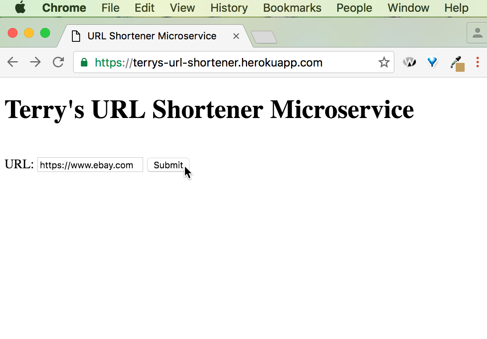
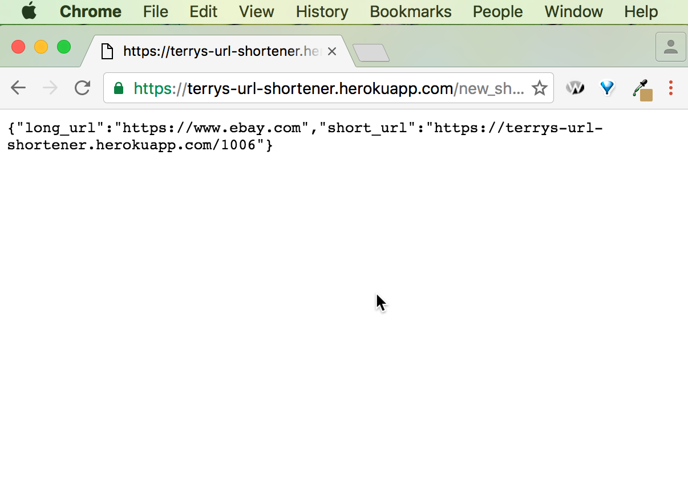

https://terrys-url-shortener.herokuapp.com/

A microservice to convert a url given by the user into a shorter version. 

e.g.: you've entered 'https://www.ebay.com/' into the input box. The app returns '{"long_url":"https://www.ebay.com","short_url":"https://terrys-url-shortener.herokuapp.com/1006"}' (not a very short url, of course, but you can imagine if the main app site were something like 'bit.ly'...). 

Then you go to https://terrys-url-shortener.herokuapp.com/1006 and you're redirected to eBay.

